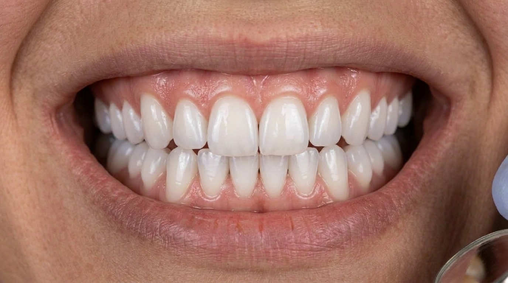

# 🦷 Dr. Xamraev Stomatologiya Klinikasi (Samarqand)

Mukammal tabassum va sog'lom tishlar uchun yuqori darajadagi zamonaviy stomatologiya klinikasi veb-sayti.

---

## 📍 Klinika Haqida
- **Bosh shifokor:** Dr. Xamraev (Oliy toifali implantolog-jarroh)
- **Manzil:** Samarqand shahri, Oydin yoʻl koʻchasi, 1-uy
- **Mo'ljal:** Samarqand avtoshohbekati (115 metr)
- **Telefonlar:** +998 (93) 331-33-33 / +998 (91) 536-23-23
- **Ish tartibi:** Har kuni 08:30 — 20:00
- **Yandex Xarita:** [Dr. Xamraev Yandex Maps](https://yandex.uz/maps/org/dr_xamraev/37346829323/prices/?ll=66.995339%2C39.690100&z=16)

---

## 🚀 Texnologiyalar
- **Frontend:** HTML5 Semantik struktura + Modular JavaScript
- **Styling:** Tailwind CSS (Official CDN) + Glassmorphism (`backdrop-blur-xl`)
- **Animatsiyalar:** GSAP 3.12 + ScrollTrigger (Hero Timeline, 3D Tilt, Live Number Counter, Confetti)
- **Interaktiv vidjetlar:**
  - 50/50 Haqiqiy Makro Tishlar Taqqoslash Slayderi (Oldin va Sog'lom)
  - Interaktiv Narx Kalkulyatori
  - Dinamik Onlayn Qabul Modali
  - Real vaqtli Yandex Maps integratsiyasi
- **Mobile UX:** Doimiy ilova uslubidagi **Mobile Bottom Navbar** va markaziy qabul tugmasi.

---

## 📄 Sahifalar
1. `index.html` — Bosh sahifa (Hero, xizmatlar, 50/50 slayder, statistika)
2. `services.html` — Xizmatlar katalogi va interaktiv narx kalkulyatori
3. `doctors.html` — Shifokorlar profillari va shaxsiy qabul
4. `results.html` — Oldin va Keyin makro natijalar portfoliosi
5. `contact.html` — Bog'lanish, ish vaqti va jonli Yandex Xarita
